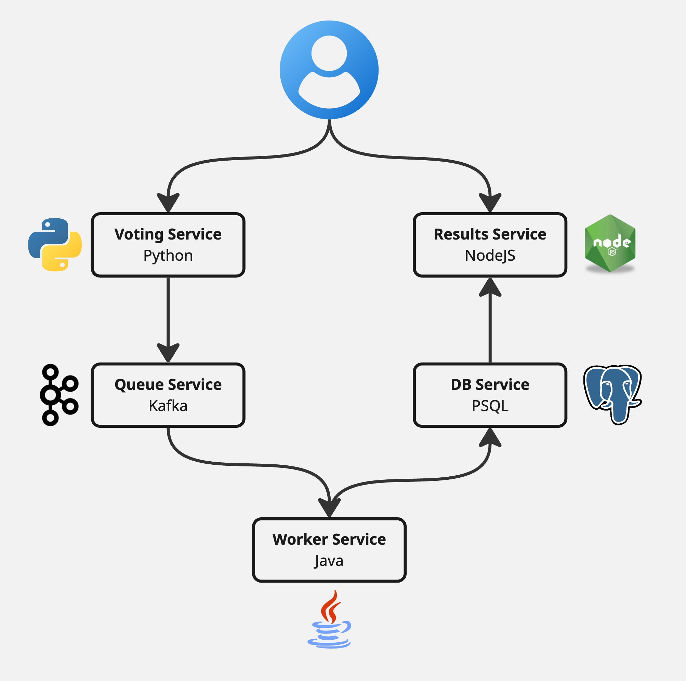

# Microservice Voting App Demo (Cats vs. Dogs)

## Introduction

This project demonstrates a simple distributed application built using a microservice architecture. It consists of 5 distinct services containerized using Docker and orchestrated with Docker Compose or Kubernetes. The application allows users to vote between "Cats" and "Dogs", and view the real-time results on a separate page.

**The primary purpose of this application is educational:** to illustrate key concepts of microservices, containerization, inter-service communication (via messaging queues and direct API calls/DB queries), and state management in a distributed system.

## What are Microservices?

Microservices is an architectural style that structures an application as a collection of small, independent, and loosely coupled services. Each service:

1.  **Focuses on a specific business capability:** For example, one service handles voting, another handles displaying results.
2.  **Is independently deployable:** You can update or change one service without needing to redeploy the entire application.
3.  **Can use different technologies:** As seen here, we use Python, Node.js, and Java for different services, choosing the best tool for the job.
4.  **Communicates over a network:** Services interact with each other, often using lightweight protocols (like HTTP/REST) or messaging queues (like Kafka).

**Why use microservices?**
*   **Technology Diversity:** Use the right language/framework for each service.
*   **Resilience:** If one service fails, it doesn't necessarily bring down the entire application (if designed well).
*   **Scalability:** Individual services can be scaled independently based on demand.
*   **Maintainability:** Smaller codebases are often easier to understand and manage.
*   **Organizational Alignment:** Teams can own specific services, allowing for faster development cycles.

This project demonstrates these concepts in a simplified way.

## Application Architecture

The application consists of the following 5 microservices:

<p align="center">

</p>

1.  **Voting Frontend (`vote`)**:
    *   **Technology:** Python (Flask)
    *   **Responsibility:** Serves the user interface for casting votes. It uses browser cookies to identify voters (allowing vote changes but preventing duplicate voters) and stores the last vote choice in a cookie for display on reload. Sends votes to the Kafka queue.
2.  **Kafka Queue (`kafka`)**:
    *   **Technology:** Apache Kafka (using `obsidiandynamics/kafka` image, bundling Zookeeper)
    *   **Responsibility:** Acts as a message broker. It receives votes from the Voting Frontend and decouples it from the Backend Worker. This makes the system more resilient; if the backend is temporarily down, votes are queued in Kafka.
3.  **Backend Worker (`worker`)**:
    *   **Technology:** Java (Spring Boot, Spring Kafka, Spring Data JPA)
    *   **Responsibility:** Consumes vote messages from the Kafka `votes` topic. It processes these votes and performs an "upsert" (update or insert) operation into the PostgreSQL database based on the `voter_id`. Uses a multistage Docker build for optimized image size.
4.  **PostgreSQL Database (`db`)**:
    *   **Technology:** PostgreSQL
    *   **Responsibility:** Persistently stores the votes. It holds the definitive record of each voter's choice (`voter_id` and their corresponding `vote`). Data is persisted using a Docker volume.
5.  **Results Frontend (`results`)**:
    *   **Technology:** Node.js (Express, EJS, node-postgres)
    *   **Responsibility:** Serves the user interface for displaying the voting results. It periodically queries the PostgreSQL database, calculates vote percentages, and dynamically updates the UI to show a split screen reflecting the current vote proportions.

## Technologies Used

*   **Frontend:** Python (Flask), Node.js (Express.js, EJS)
*   **Backend:** Java (Spring Boot)
*   **Messaging:** Apache Kafka
*   **Database:** PostgreSQL
*   **Containerization & Orchestration:** Docker, Docker Compose

## Getting Started

### Prerequisites

*   **Docker:** Ensure you have Docker Desktop (for Mac/Windows) or Docker Engine with Docker Compose (for Linux) installed. Download from [docker.com](https://www.docker.com/products/docker-desktop/).

### Running the App

1.  **Clone the repository:**
    ```bash
    git clone <your-repository-url>
    cd <your-repository-directory>
    ```
2.  **Build and Run:** Open a terminal in the project's root directory (where the `docker-compose.yml` file is located) and run:
    ```bash
    docker compose up --build
    ```
    *   `--build`: This flag tells Docker Compose to build the images for the services (`vote`, `worker`, `results`) using their respective Dockerfiles before starting the containers. This is necessary the first time and whenever you make code changes.
    *   You can add the `-d` flag (`docker compose up --build -d`) to run the containers in detached mode (in the background).

3.  **Access the Apps:**
    *   **Voting App:** Open your web browser and navigate to `<ip-address>:5000`
    *   **Results App:** Open your web browser and navigate to `<ip-address>:5001`

Cast votes on the voting app, and watch the results update automatically on the results app!

## Key Features & Concepts Demonstrated

*   **Microservice Architecture:** 5 distinct services with specific responsibilities.
*   **Technology Heterogeneity:** Using Python, Node.js, and Java in different services.
*   **Containerization:** Each service runs in its own Docker container.
*   **Orchestration:** Docker Compose defines and runs the multi-container application.
*   **Service Discovery:** Services communicate using their service names (`kafka`, `db`) thanks to Docker Compose networking.
*   **Asynchronous Messaging:** Kafka decouples the voting frontend from the backend worker.
*   **Database Persistence:** PostgreSQL stores vote data, surviving container restarts via Docker volumes.
*   **Stateful Frontend Interaction:** Cookies track voters and remember the last vote.
*   **Real-time UI Updates:** The results page polls the backend for updates (Note: *True* real-time often uses WebSockets, polling is simpler for this demo).
*   **Dynamic UI Rendering:** The results page visually splits based on vote percentages.
*   **Multistage Docker Builds:** The Java backend uses a multistage build to create a smaller, more efficient final image.

## Stopping the App

1.  If running in the foreground (without `-d`), press `Ctrl + C` in the terminal where `docker compose up` is running.
2.  To stop containers (especially if running detached) and remove the containers, network, run:
    ```bash
    docker compose down
    ```
3.  To stop containers AND remove the database volume ( **Warning:** This deletes all stored votes!):
    ```bash
    docker compose down -v
    ```

## Project Structure

```
.
├── backend/ # Java Spring Boot Backend Worker
│   ├── pom.xml
│   ├── Dockerfile # Multistage Dockerfile for Java
│   └── src/
├── docker-compose.yml # Docker Compose configuration file
├── results-frontend/ # Node.js Express Results App
│   ├── public/
│   ├── views/
│   ├── Dockerfile
│   ├── package.json
│   └── server.js
├── vote/ # Python Flask Voting App
│   ├── static/
│   ├── templates/
│   ├── Dockerfile
│   ├── app.py
│   └── requirements.txt
└── README.md # This file
```
